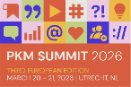
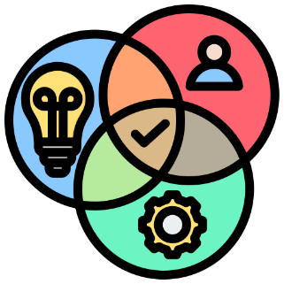
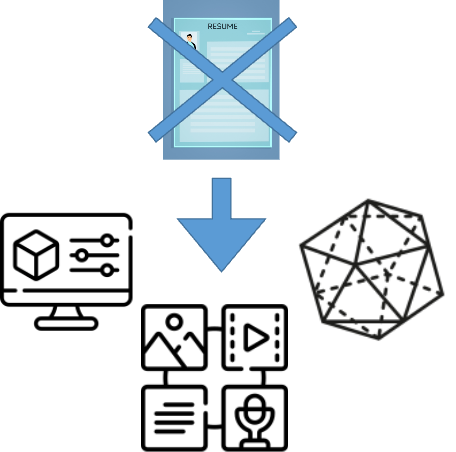
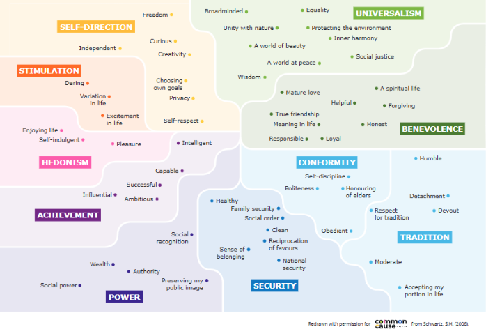
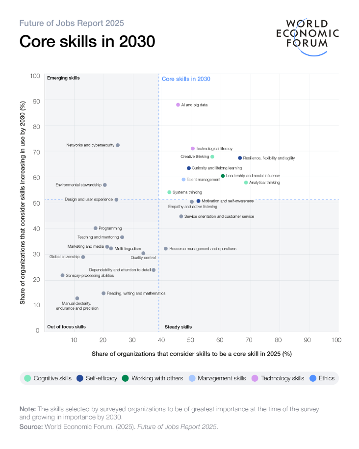
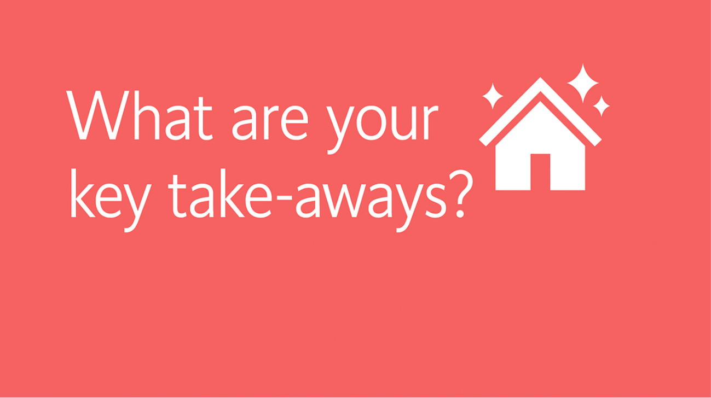
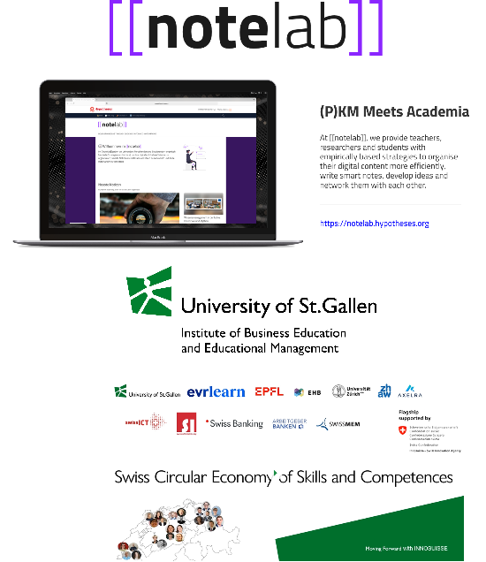

# Making Competences Visible

Collecting Puzzle Pieces of Evidence to Capture, Show, and Explain What You Know, Can Do, and Value

<!--
Brief introduction to PKM and its relevance in today’s knowledge-driven world

"A Workshop on Capturing, Validating, and Presenting Competences Using Tools for Thought."
-->

---
layout: image
image: ./assets/schatztruhe.png
---

<!--

Schatztruhe
Workshop is about you
And about a lot of positive things your competences: your values, skills and knowledge

Für die TN DINA3 Blätter mit Schatztruhen Rückseite und Feldern Vorderseite mitbringen: 

-->

---
layout: intro
---

<!--
LAYOUT: intro
PURPOSE: Introduction or agenda slide
-->

## After this workshop, you will have learned:

<v-clicks>

- #### 🎓 Problem & Goal — why competences stay invisible and what "making competences visible" requires
- #### 🧠 Tools for Thought as competence management tools — how connected notes (e.g., in Obsidian) can function as a living competence portfolio
- #### 🧩 Four Practical Moves — capture → structure→ validate → present competences and proofs of evidence

#### 
<strong>Let's get started!</strong>

</v-clicks>

<!--
Character Strengths - (Inhalt - Beispiel - Aufgabe - Reflexion/Gespräch)
Job-related tasks (Inhalt - Beispiel - Aufgabe - Reflexion/Gespräch)
general/ specific knowledge (Inhalt - Beispiel - Aufgabe - Reflexion/Gespräch)

Click on any section to navigate directly to it!

-->

---
layout: toc
title: Table of Contents
showNumbers: true
---

<!--
Character Strengths - (Inhalt - Beispiel - Aufgabe - Reflexion/Gespräch)
Job-related tasks (Inhalt - Beispiel - Aufgabe - Reflexion/Gespräch)
general/ specific knowledge (Inhalt - Beispiel - Aufgabe - Reflexion/Gespräch)

Click on any section to navigate directly to it!
-->

---
layout: section
title: From Information and Knowledge Management to Competence Management
---

# From Information and Knowledge Management to Competence Management

---
layout: center
title: Competence Management
---

  

    
    
Self-Reflection (Gruber, 2021)

  

  

    
    
Value-Skills-Knowledge Development (Euler & Hahn, 2014)

  

  

    
    
Documentation and Presentation ((Dilger & Strate, 2025; Siegel & Lohner, 2024)

  

<!--
PIM PKM ist komplexer als nur INformations- und Wissensmanagement
Tools for Thought können mehr: Kompetenzmanagement

Highlight the importance of making competences explicit in professional and educational contexts.

Explain how PKM tools (e.g., Obsidian, Roam Research) facilitate the capture, connection, and validation of competences.
-->

---
layout: section
title: "Part 1: Values"
subtitle: What you value high?
---

# Part 1: Values

## What you value high?

---
layout: image-left
image: https://images.unsplash.com/photo-1600706844152-3a29fce003b7?q=80&w=2264&auto=format&fit=crop&ixlib=rb-4.1.0&ixid=M3wxMjA3fDB8MHxwaG90by1wYWdlfHx8fGVufDB8fHx8fA%3D%3D
ratio: "50:38"
title: Part 1 – What you value high?
<!--subtitle: Configurable Ratio-->
---

<ul class="values-list">
  <li v-click><strong>Core Beliefs</strong>: Enduring beliefs about what is <strong>desirable, important, and worthy of pursuit, guiding behavior and decision-making</strong> (Bilsky, 1987; Schwartz, 2012)</li>
  <li v-click><strong>Stability/Change</strong>: tend to be <strong>rather stable</strong>; however <strong>can evolve</strong> through transformative experiences or deliberate reflection (Pieper, 2007)</li>
  <li v-click><strong>Functional Role</strong>: serve as an <strong>internal compass, shaping identity</strong>, priorities, and interactions, but are often implicit and require conscious exploration to articulate (Huber, 2016)</li>
</ul>

<!-- 
Hier geht es um Werte, die im Alltag oder in meinem Beruf von Bedeutung sind 
Werte sind an Erfahrungen, Fähigkeiten und wissen gebunden

—>How We Capture and Show Our “Values”

Wissenschaftliche Fundierung: u.a. Ryan Niemiec (2018): Character Strengths Interventions.
 -->

---
layout: default
title: Part 1 – What you value high?
---

  

  <TaskBlock title="Task">

  **Please think about the following questions:**

  - What are you proud of?
  - What would your colleagues/friends say what your strengths are? 
  - What are your main strengths?

  </TaskBlock>

<!--  
Think & Pair und Aufschreiben
-->

---
layout: image-right
image: https://images.unsplash.com/photo-1621002784630-86bd2fd2e9e0?q=80&w=2264&auto=format&fit=crop&ixlib=rb-4.1.0&ixid=M3wxMjA3fDB8MHxwaG90by1wYWdlfHx8fGVufDB8fHx8fA%3D%3D
ratio: "38:63"
title: Part 1 – What you value high?
<!--subtitle: Configurable Ratio-->
---

## “Homework”: Discover Your Strengths

**The VIA Survey** - free, scientific survey of character strengths, only 10 min

**Research shows that character strengths can help to:**
- Increase happiness and well-being, find meaning and purpose, boost relationships, manage stress and health, accomplish goals
- Take the Free Strengths Survey:
  <a class="no-break-link" href="https://www.viacharacter.org/account/register" target="_blank">viacharacter.org/account/register</a>

**And most importantly:** Take notes! Please document your results in the tool for thought of your choice.

<!--  
Explain how PKM tools (e.g., Obsidian, Roam Research) facilitate the capture, connection, and validation of competences.
Example of how to use PKM tools to record and reflect on values (e.g., creating a "values" note in Obsidian and linking it to projects or experiences).

The VIA Survey is the only free, scientific survey of character strengths in the world. Take this simple, 10 minute character test and discover your greatest strengths. Research shows that knowing and using your character strengths can help you:
- Increase happiness and well-being, find meaning and purpose, boost relationships, manage stress and health,  accomplish goals
- Take the Free Strengths Survey to begin living your best life: https://www.viacharacter.org/account/register 

And most importantly: Please document your results in the tool for thought of your choice
-->

---
layout: section
title: "Part 2: Skills"
subtitle: What you can do?
---

# Part 2: Skills

## What you can do?

---
layout: image-left
image: https://plus.unsplash.com/premium_photo-1675719068195-eabb278d2cf8?q=80&w=3387&auto=format&fit=crop&ixlib=rb-4.1.0&ixid=M3wxMjA3fDB8MHxwaG90by1wYWdlfHx8fGVufDB8fHx8fA%3D%3D
ratio: "50:38"
fit: contain
position: left
title: Part 2 – What you can do?
<!--subtitle: Configurable Ratio-->
---

- Skills are <strong>learned abilities</strong> to perform tasks—procedural how-to knowledge (e.g., Euler & Hahn, 2014).

- Subset of competence; often <strong>action-oriented</strong> (cognitive/psychomotor), e.g., mental math, teaching questioning techniques.

- Complexity: From <strong>simple</strong> (typing) to <strong>complex</strong> (facilitating dialogues).

<!--  
Examples:
Writing a clear email or navigating complex software
Organizing a project or managing time effectively
Presenting findings or negotiating with stakeholders

Scientific grounding
: Bloom’s Taxonomy (1956, revised 2001)and work-based competency frameworks

-->

---
layout: default
title: Part 2 – What you can do?
---

  

  <TaskBlock title="Task">

  **Please think about the following questions:**

  - What are your main skills?
  - What do others say about your skills?

  </TaskBlock>

<!--  

-->

---
layout: image-right
image: https://images.unsplash.com/photo-1621002784630-86bd2fd2e9e0?q=80&w=2264&auto=format&fit=crop&ixlib=rb-4.1.0&ixid=M3wxMjA3fDB8MHxwaG90by1wYWdlfHx8fGVufDB8fHx8fA%3D%3D
ratio: "38:63"
title: Part 2 – What you can do?
<!--subtitle: Configurable Ratio-->
---

## “Homework”: Discover Your Skills

**Reflect:** Identify your **(core) skills** – what can you do well, and how have you demonstrated these skills in practice?

**Document:** Create a **simple skills list** or a **skills portfolio** in the tool for thought of your choice (linking specific projects, feedback, and evidence of your abilities)

**Develop:** Choose one skill to **strengthen** and outline actionable steps for **improvement**.

**Helpful resource:** Explore the ProfilPASS (for Adults) for capturing your skills: <a class="no-break-link" href="https://www.profilpass.de/wp-content/uploads/2023/05/pp_english.pdf#page=15" target="_blank">https://www.profilpass.de</a> (especially, p. 12-5)

<!--  
Do you know your skills? (especially p. 12-15; https://www.profilpass.de/wp-content/uploads/2023/05/pp_english.pdf)
-->

---
layout: section
title: "Part 3: Knowledge"
subtitle: What you know?
---

# Part 3: Knowledge

## What you know?

---
layout: image-right
image: ./assets/nerves.png
ratio: "4:3"
title: Part 3 – What you know?
<!--subtitle: Configurable Ratio-->
---

**Justified True Belief:** a belief that is not only true but also **supported by evidence or reasoning**, distinguishing it from mere opinion or perception (Brühl, 2017)

**Contextual and Constructed:** It is context-dependent, **actively constructed by individuals**, and tied to personal experience, rather than being an absolute or static entity (Schiller & Guretzky, 2004; Probst et al., 1999)

**Types and Modalities:** It encompasses **declarative** (*know-what*), i.e. facts, concepts, and theories), **procedural** (*know-how*), and **conditional** (*know-when*) **forms** (De Jong & Ferguson-Hessler, 1996)

**Foundation for Agency:** Knowledge empowers individuals to participate meaningfully in society, make informed decisions, and drive personal and collective progress (Surma et al., 2025).

<!--  
(1) declarative knowledge (knowing that), that is, knowledge about ; (2) procedural knowledge (knowing how), that is, knowledge about processes, procedures, and methods; (3) conditional knowledge (knowing when), that is, knowledge about applying knowledge in specific contexts; and (4) metacognitive knowledge, that is, knowledge about one's own learning and thinking (Anderson et al., 2001, pp. 41-44).
-->

---
layout: default
title: Part 3 – What you know?
scroll: no
---

  

    
    
Self-Reflection

  

  

    
    
Value-Skills-Knowledge Development

  

  

    
    
Documentation and Presentation

  

<TaskBlock title="Task">

**Please think about the following questions:**

- What areas of knowledge do you possess?
- Which topics have you studied deeply through books, courses, or practice?
- What do others recognize as your areas of expertise?

</TaskBlock>

---
layout: image-right
image: https://images.unsplash.com/photo-1621002784630-86bd2fd2e9e0?q=80&w=2264&auto=format&fit=crop&ixlib=rb-4.1.0&ixid=M3wxMjA3fDB8MHxwaG90by1wYWdlfHx8fGVufDB8fHx8fA%3D%3D
ratio: "1:2"
title: Part 3 – What you know?
<!--subtitle: Configurable Ratio-->
---

## “Homework”: Discover Your Knowledge

**Reflect:** Identify your **areas of expertise** – what do you know deeply, and how have you applied it?

**Expand:** Choose one area to **explore further** and set a concrete learning goal.

Feel free to **capture** and **describe your knowledge** in the **tool of thought** of your choice e.g., in the form of a knowledge map / MOC (Doto, 2024; see also Nick Milo; e.g. Obsidian)

---
layout: auto-center
title: Takeaways
---

  

    
  

---
layout: section
title: "Outlook"
subtitle: Making Competences Visible Using a Portfolio Approach and Tools for Thought
---

# Outlook

## Making Competences Visible Using a Portfolio Approach and Tools for Thought

---
layout: quote
title: Outlook 
---

Start building your competence portfolio today—begin with one value, skill, or piece of knowledge!

— Anonymous

<!--  
Call to Action

Gap: While Tools for Thought are mentioned, there is no detailed explanation of how to use them for competence management.
PKM system for competence tracking (e.g., creating tags for values, skills, and knowledge).
Showcase a workflow for capturing, connecting, and validating competences (e.g., using backlinks, tags, and plugins).
PKM tools can facilitate reflection (e.g., using daily notes or journals).

Making Competences Visible: The Path Forward
Capturing, connecting, and presenting evidence of what we know, can do, and value
is no longer optional—it’s essential for: Professional credibility
in rapidly changing job markets Meaningful collaboration
based on transparent competence records

Continuous learning through reflective documentation
AI-augmented competence assessment
that goes beyond traditional portfolios
Next Steps
Build sustainable practices for competence articulation
Leverage AI tools to connect and synthesize evidence intelligently
Transform personal knowledge into shareable, assessable insights
Create living portfolios that evolve with your practice
The question is not whether to make competences visible—but how to do it authentically and effectively.
OutlookOutlook
Dr.

-->

---
layout: two-cols
ratio: "2:2"
title: More information
---

- NoteLab: https://notelab.hypotheses.org/ 
- Innosuisse: https://iwp.unisg.ch/de/forschung/berufliche-bildung/projekte/innosuisse-flagship-initiative/ 

::right::

---
layout: quote
---

<!--
LAYOUT: quote
PURPOSE: Display memorable quotes
-->

Life is like a box of chocolates. You never know what you're gonna get.

— Forrest Gump

---
layout: references
title: References (Selection)
---

Dilger, B. & Strate, M. (2025). Brückenbau zwischen individuellen Kompetenzen, Weiterbildungsangeboten und Anforderungen auf dem Arbeitsmarkt durch KI-gestützte Kompetenzportfolios in der beruflichen Weiterbildung. bwp@ Berufs- und Wirtschaftspädagogik – online, 48, 1–19. https://www.bwpat.de/ausgabe48/dilger_strate_bwpat48.pdf

Doto, B. (2024). A system for writing: How an unconventional approach to note-making can help you capture ideas, think wildly, and write constantly. New Old Traditions.

Euler, D., & Hahn, A. (2014). Wirtschaftsdidaktik (3., aktualisierte Aufl). Haupt.

Hartig, J., Klieme, E. (2006). Kompetenz und Kompetenzdiagnostik. In: Schweizer, K. (eds) Leistung und Leistungsdiagnostik. Springer, Berlin, Heidelberg. https://doi.org/10.1007/3-540-33020-8_9 

Heyse, V. (2017). KODE® und KODE®X – Kompetenzen erkennen, um Kompetenzen zu entwickeln und zu bestärken. In J. Erpenbeck, L. von Rosenstiel, S. Grote & H. Ochmann (Hrsg.), Handbuch Kompetenzmessung: Erkennen, verstehen und bewerten von Kompetenzen in der betrieblichen, pädagogischen und psychologischen Praxis (3. Aufl., S. 245–273). Schäffer-Poeschel Verlag

North, K., Reinhardt, K. & Sieber-Suter, B. (2018). Kompetenzmanagement in der Praxis. Springer Fachmedien. https://doi.org/10.1007/978-3-658-16872-8 

Ruch, W., Proyer, R. T., Harzer, C., Park, N., Peterson, C. & Seligman, M. E. (2010). Values in action inventory of strengths (VIA-IS): Adaptation and validation of the German version and the development of a peer-rating form. Journal of Individual Differences, 31(3), 138–149.

Siegel, S. T., & Lohner, D. (2024). Wissensmanagement von Lehrenden mit „Digital Tools for Thought“: Potenziale, Grenzen und Einsatzmöglichkeiten. Neues Handbuch Hochschullehre (NHHL), 114, 1–20.

Siegel, S. T., Lohner, D., & Arnold, M. (2025). Reimagining Teaching Portfolios Through Personal Knowledge Management with Digital Tools for Thought. Zeitschrift für Hochschulentwicklung, 20(3). https://doi.org/10.21240/zfhe/20-3/11 

World Economic Forum. (2025). Future of Jobs Report 2025. https://www.weforum.org/publications/the-future-of-jobs-report-2025/digest/

---
layout: center
---

## Thank You

Questions?

[GitHub Repo](https://github.com/profmanagement/makingcompetencesvisible.git)
